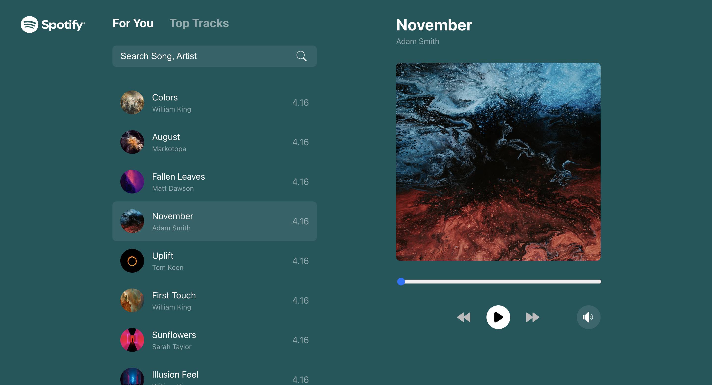

# Spotify - A Music Streaming Web Application


A modern music streaming web application built with React and Vite. This application allows users to browse, search, and play music tracks seamlessly.

## Prerequisites

Before you begin, ensure you have met the following requirements:

- Node.js and npm installed
- Clone this repository

## Installation

1. Clone the repository:

```bash
git clone git@github.com:divyanshubhargav/music-streaming-app.git
cd music-streaming-app
```

2. Install dependencies:

```bash
yarn install
```

3. Start the development server:

```bash
yarn dev
```

4. Access the website by navigating to http://localhost:5173/ in your web browser.

## Features

Spotify is a web application that offers the following features:

- Browse music tracks by artist, album, and genre
- Search for songs, artists, and albums
- Play, pause, and skip tracks
- Responsive design for mobile and desktop views

**SCREENSHOTS:**

Desktop View:



Mobile View :


## Developed With

- [Visual Studio Code](https://code.visualstudio.com/) - A source code editor developed by Microsoft for Windows, Linux and macOS. It includes support for debugging, embedded Git control, syntax highlighting, intelligent code completion, snippets, and code refactoring
- [React](https://reactjs.org/) - A javascript library for building user interfaces
- [Vite](https://vitejs.dev/) - It is a new breed of frontend build tooling that significantly improves the frontend development experience.
